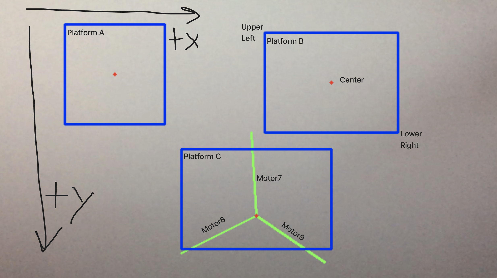

# emma_cv
Computer vision and genetic algorithm code originally designed to automatically tune the PID controller for a variation on a Stewart Platform.

## Ensure code is up to date
1. Check to see if you have any changes that would be overwritten by a pull
    ```
    git status
    ```
2. If you care about your changes, "stage" and "commit them
    ```
    git add -p
    git commit -m "<describe your changes briefly>"
    ```
3. If there have been changes to the main branch
    ```
    git pull --rebase origin main
    ```

## Running this code
Currently this code can be executed manually in python3, but there are plans to ROS-ify this by mid-2025. 
1. Ensure that the corresponding [Arduino Code](https://github.com/nd228/thesis_sisyphus/tree/main) is running on your mega.
2. With "absolute pathing", you can run the script in any terminal with:
    ```
    python ~/thesis_code/emma_cv/scripts/main.py
    ```
3. If everything works, an OpenCV window should appear showing your camera output.

## Configuring 

## Computer Vision Configs
These are probably the configs you'll change the most, as they vary based on the angle of the camera and motor configurations. The json objects labeled `platform_x_bounds` describe simple bounding boxes and `center`s the CV code use to calculate ball telemetry. Remember! Positive Y in OpenCV is DOWN!



## Serial Configs
The `telemetry_delay` is simply the amount of time between sending telemetry strings to your arduino/serial device. And the `serial_port` is the serial device location on your computer, this should match the port selected in the Arduino IDE.

### Genetic Algorithm Configs
The genetic algorithm has a number of configs you can tweak to affect performance as well as audience experience. The `evaluation_s` is simply the time (in seconds) spent evaluating each genome. Increase `drop_penalty` if you want to increase the weight of a genome being thrown out. The `generation_size` and `population_cap` refer to the number of genomes to cull/recreate and the max population, respectiely. You can increase these numbers to more quickly achieve a solution, but it will also require more computing resources. NOTE: in order to have enough genomes to reproduce, ensure that population cap is always at least 2 more than generation size.
